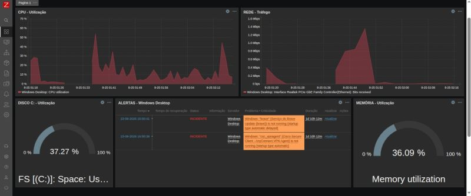
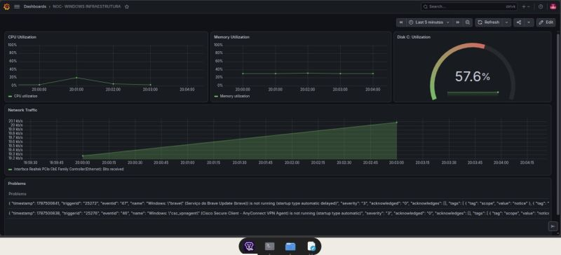

# Zabbix + Grafana — Monitoramento de Infraestrutura

Laboratório de monitoramento de infraestrutura desenvolvido com **Zabbix 7 + Grafana**, simulando um ambiente NOC para monitoramento de um computador Windows.

O projeto é uma evolução de um laboratório anterior com Zabbix, adicionando o Grafana para visualização das métricas através de dashboards.

## Arquitetura

```text
┌──────────────────────────────┐
│        Zorin OS 18.1         │
│                              │
│       Zabbix Server          │
│       PostgreSQL             │
│       Grafana                │
└──────────────┬───────────────┘
               │
           Rede Local
               │
               ▼
┌──────────────────────────────┐
│       Windows Desktop        │
│                              │
│       Zabbix Agent 2         │
│                              │
│  CPU | RAM | Disco | Serviços│
└──────────────────────────────┘
```
## Tecnologias

- **Zabbix 7** — monitoramento e coleta de métricas
- **Grafana** — dashboards e visualização
- **PostgreSQL** — banco de dados
- **Zabbix Agent 2** — coleta de dados no Windows
- **Zorin OS 18.1** — servidor de monitoramento
- **Windows** — host monitorado
- **API Zabbix** — integração com Grafana

---

## Monitoramento

O ambiente foi configurado para monitorar:

- CPU
- Memória RAM
- Armazenamento
- Disponibilidade do host
- Serviços do Windows
- Triggers e Problems

---

## Fluxo de Monitoramento

```text
Coleta de métricas
       ↓
Monitoramento
       ↓
Trigger
       ↓
Problem
       ↓
Investigação
       ↓
Normalização

```

## Testes Realizados

Foi validada a comunicação entre o servidor Zabbix e o Windows através da porta 10050, além do funcionamento do serviço Zabbix Agent 2.

Também foram realizados testes de Triggers e geração de Problems para simular eventos de monitoramento e validar o funcionamento do ambiente.

## Imagens




